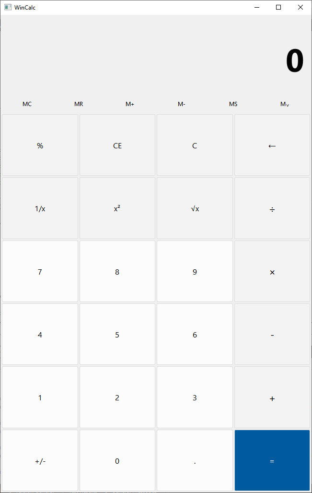
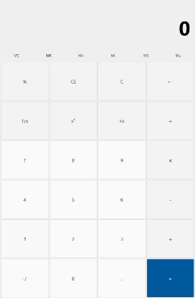

# WinCalc
WinCalc is a clone of the Windows calculator application using Qt and C++ as part of an independent learning project.

### Demo

# Features Coming
<ul>
 <li>Keyboard support</li>
 <li>Programmer calculator</li>
 <li>Memory</li>
</ul>

### Possible features
<ul>
 <li>Color schemes</li>
</ul>
