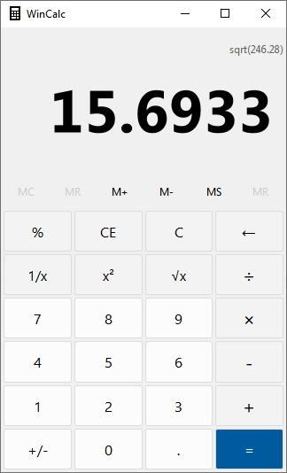
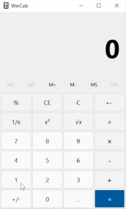

<h1 align = "center">WinCalc</h1>
<h3 align="center">WinCalc is a clone of the Windows calculator application using Qt and C++</h3>

 

<h2>Features</h2>
 
WinCalc currently supports the following mathematical operations:

  <ul>
   <li>Addition</li>
   <li>Subtraction</li>
   <li>Multiplication</li>
   <li>Division</li>
   <li>Modulo</li>
   <li>Sign inversion</li>
   <li>1/(x)</li>
   <li>sqrt(x)</li>
   <li>sqr(x)</li>
  </ul>
 

<h2>Memory</h2>
 
Memory functions available:

  <ul>
   <li>Store memory</li>
   <li>Add to memory</li>
   <li>Subtract from memory</li>
   <li>Recall memory</li>
   <li>Remove recent memory</li>
   <li>Clear all memory</li>
  </ul>
 

# Features Coming
<ul>
 <li>Keyboard support</li>
 <li>Programmer calculator</li>
</ul>

### Possible features
<ul>
 <li>Color schemes</li>
</ul>
